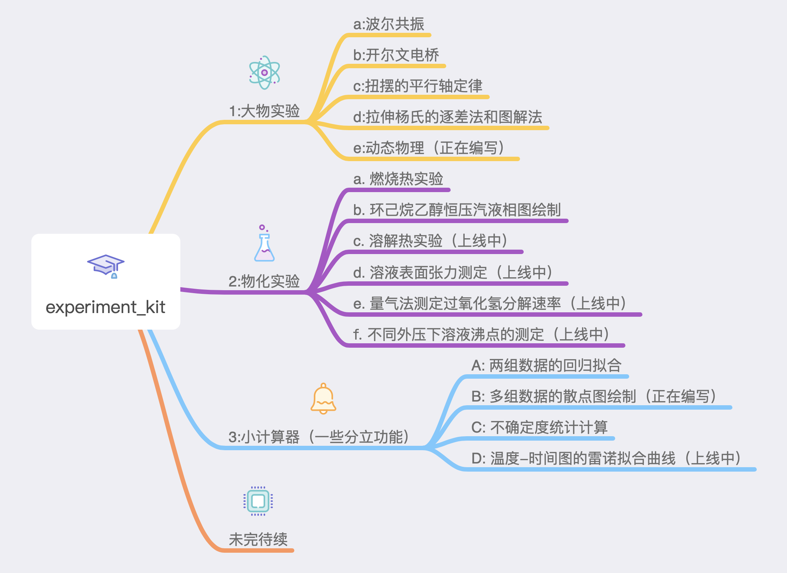
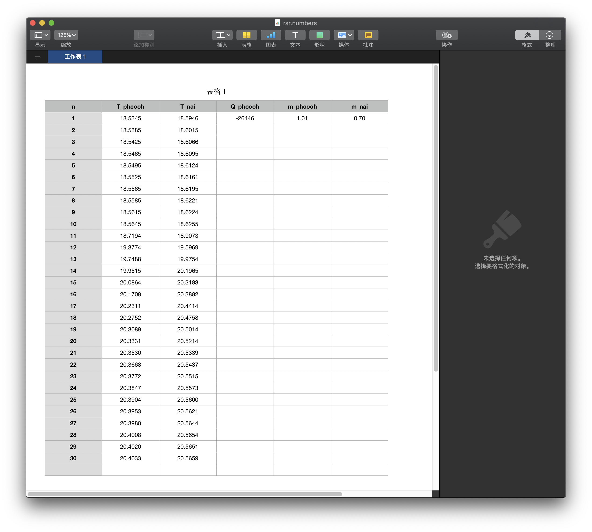
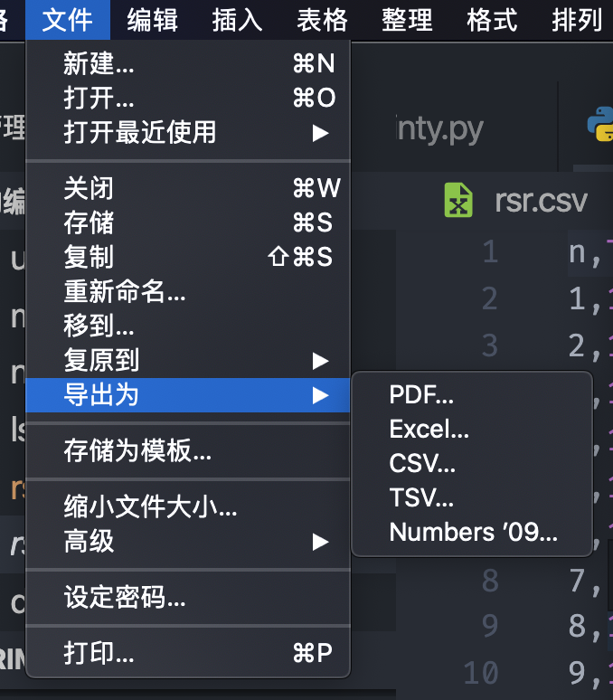

# experiment_kit  v0.10

### 此项目致力于将大学期间可能遇到的各类实验的：

### 1. 数据处理（统计处理，不确定度求解等）

### 2. 作图拟合（线性拟合，指数拟合及其参数求解）

### 3. 外推求解（雷诺较正）

### 4. 曲线拟合与通过曲线斜率求物理量

### 5. 其他在各大大学实验中可能遇到的数据处理操作

### 全部通过对应实验的python及其他功能脚本来搞定

### 让坐标纸见鬼去吧！！！！！最好卡西欧也不用！！

本项目的功能框架：



***

#### ~~ 一点小说明 ~~

1. 本项目基于python的常用库，比如

   ```python
   import numpy as np
   import matplotlib.pyplot as plt
   import pandas as pd
   import statsmodels.api as sm # 第三方大型统计库
   import os # 进行一些shell操作,内置库
   import sympy as sy # 进行可能的解析求解
   import sqlite3 # 内置库，处理自带数据库可能用到 
   ```

   因此，在使用本项目的脚本程序时，需要现在电脑上配置好最新的python3环境，并且安装配置好这几个库。安装python之后，可以用pip直接将这几个库给装好

   Tips: statsmodels.api库可能有点难安装，需要先安装依赖库wheel库再进行安装操作，详情可戳：https://blog.csdn.net/songrenqing/article/details/78935363

   笔者在anaconda上面管理库的话就没有这些问题，也强烈建议想要经常使用python的同学安装集成的anaconda库（尤其是mac用户，当然Linux用户安装Miniconda就够用了）

2. 用户在使用本项目时，须认真阅读此Readme后面有关各项目的输入文件格式，并且明确自己这个实验的各个物理量的单位和意义，以及各步数据处理与作图拟合的操作与意义，在**程序的总目录下**准备好对应的输入文件，才能利用这个软件包得到理想的结果。事实上完成实验报告的时候这些数据处理的方法思路是需要理清楚的，我们这个程序包做的事情只是解放你的双手，但不是解放你的大脑。运行这个程序时，windows玩家可以通过IDLE运行main_menu.py打开图形化界面，Mac和Linux用户直接在终端下cd进该文件夹，然后python(python3) main.py即可进入程序。

3. 本程序目前在v0.10阶段，无论是功能方面还是界面方面都还比较粗糙，但开发者们已经对其程序运行结果的可靠性进行过多次测试，只要你的输入文件是按照格式准备好的，运行出来的数据处理结果和坐标图会十分不错！而且我们的控制流main模块具有比较好的兼容性和可扩展性，这个program将会慢慢做大，直至涵盖整个大学所涉及到的各类实验的重要数据处理！

4. 本项目代码在Mac上编写，所有编码均是utf-8，如果有乱码一定是本机的gbk没法看懂utf-8，转换一下编码即可

5. 本项目的输入文件要求是.csv格式，这样的格式比较规范而常用，便于程序读取。用户可以用excel（Windows）和Numbers（Mac）按照各功能对应的要求来准备好.csv输入文件，再在此文件的目录下运行程序。

   csv文件的准备方法：

   打开excel或Numbers（以Numbers为例），按照格式要求输入数据，注意项目名称的一致性。如果觉得手打项目名称麻烦，可以用excel或Numbers打开程序包中示例里面的.csv文件（或者是将说明里面的.csv展示直接复制粘贴到记事板中，另存为.csv文件，再打开），然后再编辑，之后保存为.csv文件，如下图，以燃烧热的数据准备为例：

   


​	如此操作就可以了

**注意：所准备.csv文件的格式，数据单位（一般就是实验当场测得的数据的单位，如果有不同会特殊说明）需要和格式要求保持一致，且.csv文件的文件名和标签名需要按照要求，否则无法得到所需结果！**

6. 在使用某个功能时：

   **务必仔细阅读该功能的说明，按要求准备输入文件**

   **务必仔细阅读该功能的说明，按要求准备输入文件**

   **务必仔细阅读该功能的说明，按要求准备输入文件**

   重要的事情说三遍！

7. 祝您使用愉快！

8. CopyRight ® JamesBourbon's team, first released in 2019

   Contact: ff6757442@163.com or ff6757442@github.com

TIps: Windows用户可以使用带按钮界面的主程序。Mac和Linux用户直接在终端运行程序就可以（python做gui的功能着实不行，tkinter对mac和linux的支持太差）


***

## 大物实验模块

#### 1. 拉伸法测杨氏模量（拉伸杨氏）

注意你的两个input文件的名字都不能改动！

第一个input文件**”拉伸杨氏_input_1.csv"**的格式:

``` 
F,x_a,x_d
10.0,1.65,1.68
11.5,1.91,1.91
13.0,2.20,2.19
14.5,2.48,2.45
16.0,2.73,2.71
17.5,3.01,3.00
19.0,3.31,3.29
20.5,3.58,3.58
22.0,3.83,3.85
23.5,4.13,4.14
25.0,4.40,4.41
26.5,4.53,4.56
```

此处F，x_a，x_d均是由实验直接测出，F的单位为9.8N（也即1kg）

准备输入文件时F，x_a，x_d的名称不能改动

第二个input文件**"拉伸杨氏_input_2.csv"**的格式：

```
物理量,数值,意义
d_dx,0.05,钢丝形变量的仪器误差/cm
d_dF,0.02,钢丝拉力的仪器误差/kg
D,187.86,镜尺距/cm
d_D,0.05,镜尺距测量仪器误差/cm
L,39.25,钢丝长度/cm
d_L,0.05,钢丝长度测量仪器误差/cm
d,0.810,钢丝直径1/mm
d,0.809,钢丝直径2/mm
d,0.803,钢丝直径3/mm
d,0.805,钢丝直径4/mm
d,0.804,钢丝直径5/mm
d,0.805,钢丝直径6/mm
d0,0.000,弹簧测力计初读数/mm
d_d,0.004,钢丝直径测量仪器误差/mm
b,8.234,光杠杆常数/cm
d_b,0.002,光杠杆常数仪器误差/cm
F,见input_1,所用拉力/(9.8N)
x_a,见input_1,加重时观测到的伸长量/cm
x_d,见input_1,减重时观测到的伸长量/cm
```

将这里面的数字替换成自己实验的时候实际做出来的值，就可以了。注意在输入的时候不要额外增加空格，保证其csv文件的格式。csv文件可以用excel打开，也可以用excel准备。准备的时候注意标签名称以及各个物理量的名称都不能改动否则会影响读入

准备好两个input文件，就可以调用杨氏模量的处理模块啦。

#### 2.波尔共振: 幅频特性曲线和相频特性曲线的绘制

实验本身分三块，故我们要求准备三个输入文件

第一个输入文件：**自由振荡_input.csv** 格式如下：

```csv
sita,T,
160,1.557,
150,1.558,
135,1.559,
130,1.560,
120,1.561,
110,1.562,
102,1.563,
96,1.564,
87,1.565,
80,1.566,
72,1.567,
66,1.568,
56,1.569,
```

此处sita为振幅，T为周期，均是实验中直接记录得到的数据。这个数据用来做受迫振荡的时候固有频率的较正，需要有！且按照实验实际来输入即可，行数不限，但sita和T的标签名不可改动

第二个输入文件：**阻尼振荡_input.csv** 格式如下：

```
data_beita,test1,test2,test3,
T_10,15.660,15.648,15.658,
sita1,141,158,132,
sita2,126,141,118,
sita3,112,126,105,
sita4,100,112,94,
sita5,88,100,84,
sita6,78,89,74,
sita7,70,79,66,
sita8,62,70,59,
sita9,54,62,52,
sita10,48,54,46,
```

用来记录阻尼振荡的实验数据，此处给出的是本人的标准数据（所有的标准文件内数据均是标准数据，可作参考），请按照实验实际将自己的数据替换到文件中，即可，注意其他标签不要改动。

第三个输入文件：**受迫振荡_input.csv** 格式如下:

```
10T_bl,sita_bl,fai_bl,
16.163,78,30,
15.983,98,40,
15.859,116,50,
15.773,130,60,
15.697,141,70,
15.640,147,80,
15.609,148,85,
15.586,148,90,
15.568,148,95,
15.544,146,100,
15.493,137,111,
15.449,126,120,
15.386,109,131,
15.324,93,139,
15.192,70,149,
```

三组数据分别为：累积放大法测量摆轮周期值10T，摆轮的振幅sita_bl，相位差fai_bl，输入数据时标签名不可改动，且必须按照相位差递增（或递减）的顺序来记录（大物实验老师也会强调这一点要求）

#### 3.  扭摆法测定平行轴转动惯量

需要准备输入文件：**扭摆_input_1.csv**和**扭摆_input_2.csv** 格式如下：

**扭摆_input_1.csv**：

```
x0,T_mean
5,2.636
10,3.408
15,4.4
20,5.504
25,6.664
```

各物理量对应意义：扭摆的滑块间距，所测得周期的平均值

**扭摆_input_2.csv**：

```
物理量,数值,意义
I_stick,4.09E-03,金属杆的理论转动惯量
k,0.03075,扭摆弹簧的转动系数
m,241.7,质量
l,3.331,长度
Ra,3.51,外径
Rb,0.57,内径
```

注意：I_stick为金属杆的理论转动惯量，由之前的实验得到。

在准备输入文件时，各物理量标签和表头的名称不可更改！

#### 4. 开尔文电桥测定铜棒电阻率

需要准备输入文件：**电桥_input.csv** 格式如下：

```
L,R,d,d0
240,1.40,4.005,0.053
280,1.68,4.006,0.053
320,1.95,4.005,0.053
360,2.15,4.010,0.053
400,2.41,4.010,0.053
440,2.66,4.006,0.053

```

各量意义：铜棒长度/mm，经开尔文电桥以0.001力臂测得的电阻盘示值，铜棒在对应长度附近用螺旋测微器所测得的横截面直径/mm，弹簧测力计完全闭合时的初读数/mm。注意表头不可更改。运行之后可以得到线性拟合图，线性拟合图中会输出斜率，由斜率可以自行计算电阻率大小。与此同时可以输出R2值来保证线性拟合度。


***

## 物化实验模块

#### 1. 燃烧热的测定：雷诺较正外推法作图

你在做这个物化实验的时候，从氧弹量热计上面读出来的是∆Tn和T0，通过这两个值的关系，先求出Tn（预习报告上面也是这么要求记录原始数据的），我们这里以Tn为输入数据来做数据处理和雷诺较正外推。由于历史原因，此处雷诺较正外推法的环境温度应用平均温度法求取。

输入文件：**燃烧热_input.csv** 的格式如下：（建议从Excel导出）

```
n,T_phcooh,T_nai,Q_phcooh,m_phcooh,m_nai
1,18.5345,18.5946,-26446,1.01,0.70
2,18.5385,18.6015,,,
3,18.5425,18.6066,,,
4,18.5465,18.6095,,,
5,18.5495,18.6124,,,
6,18.5525,18.6161,,,
7,18.5565,18.6195,,,
8,18.5585,18.6221,,,
9,18.5615,18.6224,,,
10,18.5645,18.6255,,,
11,18.7194,18.9073,,,
12,19.3774,19.5969,,,
13,19.7488,19.9754,,,
14,19.9515,20.1965,,,
15,20.0864,20.3183,,,
16,20.1708,20.3882,,,
17,20.2311,20.4414,,,
18,20.2752,20.4758,,,
19,20.3089,20.5014,,,
20,20.3331,20.5214,,,
21,20.3530,20.5339,,,
22,20.3668,20.5437,,,
23,20.3772,20.5515,,,
24,20.3847,20.5573,,,
25,20.3904,20.5600,,,
26,20.3953,20.5621,,,
27,20.3980,20.5644,,,
28,20.4008,20.5654,,,
29,20.4020,20.5651,,,
30,20.4033,20.5659,,,

```

测量次数n（每30s一次）以及测量苯甲酸，萘的燃烧反应温度T_phcooh，T_nai的单位均为摄氏度（也就是你预习报告上面会写的那个），它们按列输入。Q_phcooh为苯甲酸的标准燃烧焓（单位:J/g），m_phcooh和m_nai为苯甲酸和萘的质量（电子天平测得，单位g），输入时务必放在紧靠着栏目行下的第一个数据行，否则会读入错误。一样的，标签栏各标签名称不可改动。

#### 2. 环己烷乙醇恒压汽液平衡相图的绘制

单次实验的时间只够进行单组分的汽液平衡两相组成测定，这使得输入文件相对简单，输入文件**cy_al_input.csv**的格式如下：

```csv
data_name,values,meaning
zsl_g,1.3888,气相成分折射率均值
zsl_l,1.3672,液相部分折射率均值
t_bp_obs,67.9,沸点读数/℃
t_env,25.8,沸点外温度计测得环境温度/℃
t_0,50.50,橡胶管处温度示值/℃
p_env,102.09,气压计读出的环境大气压/Kpa
t_p,22.5,气压计上的温度计读数/℃
delta_t_1,-0.01,温度计示值校正值/℃
```

在预习实验的时候实验书会强调温度较正，压力较正和最终的相图结果，而实验老师也会强调这些实验数据的记录与意义，只要你是认真做了实验的，按照实验所得到的的数据，对应地准备好这个输入文件，就可以得到汽液平衡相图

在进行绘制内，有两个地方是标准数据，一个是附录内30℃下环己烷乙醇二元溶液中折射率和组分的关系，我们将这个数据存放在了数据库中，程序会自动根据你输入的折射率来求取体系的组分。第二个是老师在实验的时候会给出的，用于绘制相图曲线的标准数据，这个数据我们同样存储在数据库中，并且在运行程序的时候调用，完成绘图。用户只需要输入自己本次实验得到的数据就可以了

再次强调：在准备Input文件的时候不要去改动各标签名称！


***

## 番外功能1：单组数据不确定度的求取

## 番外功能2：两组数据的线性拟合

数据是直接输入的

运行不确定度的计算时，输入单组数据，系统会自动输出这组数据的统计分析结果以及各不确定度（A类分量，B类分量，不确定度总值，相对不确定度）

运行线性拟合计算时，输入单组数据，系统会自动输出这组数据的线性拟合分析结果，包括斜率，截距和R2等数据

***

如果您有什么改进意见，欢迎联系作者

JamesBourbon: ff6757442@163.com

祝您使用愉快！
